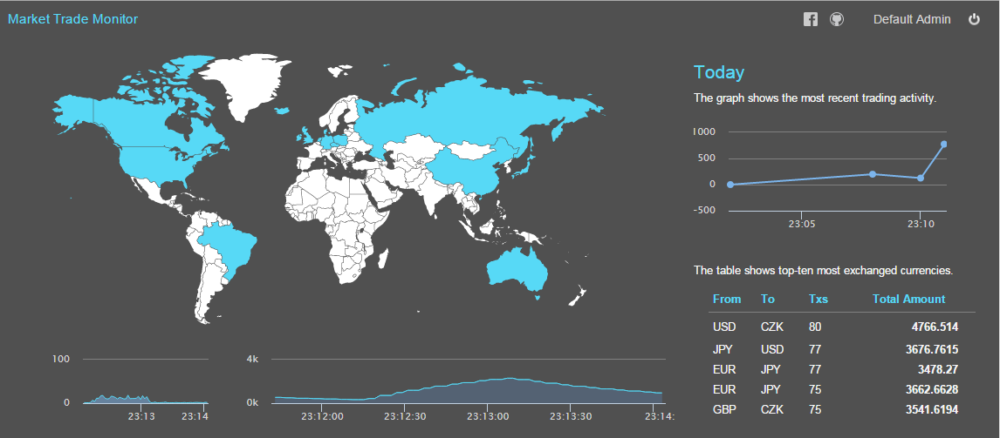
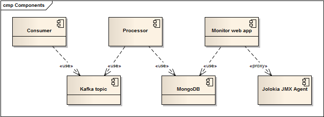
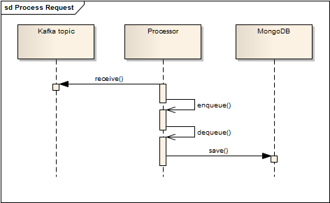
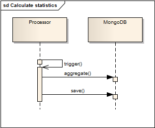
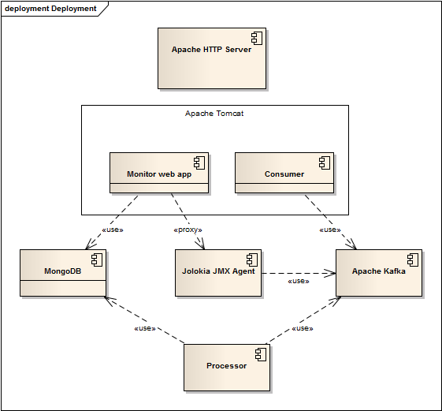

# Market Trade

This is a sample application demonstrating use of several technologies such as Spring Integration/Boot/WebMVC, Apache Kafka, MongoDB and selected Javascript frameworks on a "trading" solution. 

The solution consists of a several modules realizing the following set of functions:

* a REST/JSON (consumer) service able to consume requests, 
* a data processor handling consumer requests and saving them into a database,
* a simple front-end (monitor) web application showing received data statistics as well as selected runtime indicators.

## User Interface
There is a [REST endpoint](http://104.155.51.247/consumer/request) exposed to end-users consuming JSON requests (please refer to [service description](#ConsumerService) for further reference) and [web user interface](http://104.155.51.247/monitor/) for business/application monitoring.

   

The monitor application requires the user to authenticate:

* username *admin*
* password *pwd*

## Components
There are several components realizing given functions:

   

* **Consumer** - a web application (packaging war) exposing a simple REST service; the service receives user requests, performs validation and send the request to the Kafka topic,
* **Processor** - a standalone application (packaging jar) attached to a Kafka topic, saving data into the database; the application computes predefined statistics as well,
* **Monitor** - a web application (packaging war) realizing the user interface,
*  **Jolokia JMX Agent** -- monitors selected attributes of Apache Kafka and exposes them in form of a HTTP service.

### Use of Kafka

The main concept is based on use of Apache Kafka messaging between the consumer and the processor components. Use of messaging is generally recommended pattern for applications of this kind -- where users may generate large amount of requests that need to be processed. These requests can be quickly validated and stored in messaging topic, one or more processor applications may then connect to the same topic and handle the load.

Kafka offers significantly better performance and scalability options, see Quality view below for further details.

### Use of Spring 

There are several frameworks in use from the Spring suite, namely:

* **core** -- used for component wiring, a mix of XML and annotations is in use, where components requiring configuration are shown in XML, other components are annotated/autowired,
* **integration** -- used for message processing and execution management, there are extensions available for Kafka messaging providing inbound and outbound adapters,
* **boot** -- used by processor module to handle console parameters and application context loading,
* **webmvc** -- to expose REST services, used by consumer and monitor modules,
* **security** -- to provide authentication for the monitor module,
* **data** -- to access MongoDB by processor and monitor modules,
* **test** -- to help testing REST services, mainly.

### Use of MongoDB

Use of MongoDB on this example seems to be a good option because of it's great performance, sharding options and powerful aggregation framework. While the application is rather simple from the data perspective, it could easily be implemented using any traditional SQL database such as MySQL, PosgreSQL or similar. Anyway, choosing MongoDB seems to be more future-proof in this particular case.

### Use of AngularJS

The AngularJS framework seems to be good match for front-end because of it's REST features (resource support), easy to use and effective final code. There are two external components integrated as directives:

* **jVectorMap** -- showing the overall map,
* **Highcharts** -- showing throughput and JMX charts.

## Services

There are several REST services exposed by consumer and monitor modules.

### Consumer Service

Provided by consumer module, the service is expected to be exposed to end-users (clients) and accepts data of given structure (trade requests).

	POST ~/consumer/request

#### Request

There are no URL parameters. There should be a request body containing the following data in JSON form:

* **userId** -- user identifier, string, mandatory,
* **timePlaced** -- request time, firmat 'dd-MMM-yy HH:mm:ss', mandatory,
* **originatingCountry** -- [country code](http://en.wikipedia.org/wiki/ISO_3166-1_alpha-2), 2 letters, mandatory,
* **currencyFrom** -- [currency code](http://en.wikipedia.org/wiki/ISO_4217), 3 letters, mandatory,
* **currencyTo** -- [currency code](http://en.wikipedia.org/wiki/ISO_4217), 3 letters, mandatory,
* **amountSell** -- amount to sell, number, range 1-1000000, mandatory,
* **amountBuy** -- amount to buy, number, range 1-1000000, mandatory,
* **rate** -- exchange rate, number, mandatory.

Example:

	{
    	"userId": "134256", 
        "currencyFrom": "EUR", 
        "currencyTo": "GBP", 
        "amountSell": 1000, 
        "amountBuy": 747.10, 
        "rate": 0.7471, 
        "timePlaced": "24-JAN-15 10:27:44", 
        "originatingCountry": "FR"
     }

#### Response

Returns 200 OK and a JSON containing the transaction identifier, for example:

	{
    	"txId": "ad2d0300-d237-11e4-bd9e-0002a5d5c51b"
    }

#### Errors

Returns 400 BAD REQUEST and a JSON structure describing the error, for example:

	{
    	"currencyFrom": "invalid currency code"
    }

### User Service

Provided by monitor module, the service is expected to be exposed to internal users (admins) only. The service provides information about currently logged-in user.

	GET ~/monitor/rest/user

The service requires authenticated user.

#### Request

There are no URL parameters.

#### Response

Returns information about name and roles of the current user, for example:

	{
    	"name": "John Admin",
    	"roles": [
        	"ADMIN"
        ]
    }

#### Errors

There are no parameters/body to validate, no errors are provided.

### Stats Service

Provided by monitor module, the service is expected to be exposed to internal users (admins) only. The service provides basic info related to data to be displayed: current exchange statistics by country and top-five of currencies by number of transactions.

	GET ~/monitor/rest/stats    

The service requires authenticated user.

#### Request

There are following URL parameters:

* **cc** -- [country code](http://en.wikipedia.org/wiki/ISO_3166-1_alpha-2), 2 letters, optional (limits response to given country if specified, worldwide otherwise).

#### Response

Returns information about current exchange statistics by country (*tput* element) and top-five of currencies by number of transactions (*xchg* element), for example:

	{
    	"tput": {
        	"CZ": 8575,
            "GB": 9585,
            "FR": 94877
        },
        "xchg": {
        
    	}
    }

#### Errors

Returns 400 BAD REQUEST and a JSON structure describing the error, for example:

	{
    	"cc": "invalid country code"
    }

### Throughput Service

Provided by monitor module, the service is expected to be exposed to internal users (admins) only. The service provides detailed throughput information in form of timestamp-value pairs (to be shown in chart).

	GET ~/monitor/rest/stats/tput    

The service requires authenticated user.

#### Request

There are following URL parameters:

* **cc** -- [country code](http://en.wikipedia.org/wiki/ISO_3166-1_alpha-2), 2 letters, optional, (limits response to given country if specified, worldwide otherwise).

#### Response

Returns information about current exchange statistics by country (*tput* element) and top-five of currencies by number of transactions (*xchg* element), for example:

	{
    	"tput": {
        	"CZ": 8575,
            "GB": 9585,
            "FR": 94877
        },
        "xchg": {
        
    	}
    }

#### Errors

Returns 400 BAD REQUEST and a JSON structure describing the error, for example:

	{
    	"cc": "invalid country code"
    }

## Data
There are following entities stored permanently in the MongoDB.

### Trade Requests
Corresponds to incoming request and is enriched with the following attributes:

* **timeCreated** -- request time,
* **transactionId** -- transaction identifier, generated on front-end and provided to the user.

Stored in *requests* collection.

### Statistics
TODO

Stored in *throughputStats* collection.

### Users
Stores user accounts and corresponding roles.

## Processes

There are following activities implemented.

### Place Request

The activity shows trade request being issued by the consumer and handled by the consumer module. The call is synchronous and all errors are propagated to the end-user in form of error response. Multi-threading is managed by the servlet container.

   

### Process Request

The activity shows trade request being processed by the processor module and stored in the database. 

   

### Calculate Statistics

The activity shows computation of statistics triggered on regular basis. 

   

### Display Results

The activity shows monitor module accessing data. 

   

## Quality

There were following quality attributes checked.

### Source Code

TODO unit-tests

### Performance 

TODO perf test

### UAT

TODO not implemented, could be

## Security
There are two endpoints available: the REST endpoint where end-users issue their requests and the monitor web application.

### REST Endpoint
The endpoint is exposed to end-users and should be well protected in terms of access control, usage quotas, DoS protection, transfer 

## Deployment

The solution is deployed to Google Compute Engine, [n1-highmem-2](https://cloud.google.com/compute/) type (2 cores, 13GB RAM) as follows:

   

## Operational Support
TODO JMX: tomcat, producer, kafka

## Further Improvements

### User Interface
The user interface is not very consistent -- it is mixing both business (map, request chart) and operational views (CPU load, Kafka topic). To fix this, a standard application monitoring system (such as Zabbix or similar) can be introduced, performing detailed application and network analysis. The CPU load and Kafka topic charts could be removed from the view.

There could be more business functionality added in terms of existing data analysis, such as

* **displaying more historical data** -- the throughput chart (*Today* chart) shows only limited data range, the existing chart implementation could be replaced with a [Highstock](http://www.highcharts.com/products/highstock) alternative, which is capable of displaying wider ranges of historical data,
*  **displaying more currencies** -- the currency table shows only *top* few records, the table can be extended and there could be detailed chart showing evolution of the currency exchange in time,
*  **extending map** -- the map component is very illustrative and eye-catching, the map can display more then just actual throughput, one or more [markers](http://jvectormap.com/examples/marker-icons/) can be attached to regions (countries) displaying data like currency, last transaction time etc.

### Performance Tuning
The whole solution has been designed with extra focus on scalability. All components can be deployed in multiple instances and the load can be balanced:

* **Consumer** -- the component is deployed into servlet container, there may be multiple containers in use being controlled by the Apache proxy. All instances can post messages into the same Kafka topic.
* **Kafka** -- the messaging topic can be split into partitions, default implementation of Kafka client uses round-robin partition strategy; a large number of messages can be spread into multiple channels (partitions) and processed concurrently.
* **Processor** -- there should be as many instances of the processor component as partitions; the existing implementation (standalone application) may not be ideal for operations, some kind of cluster management such as Hadoop YARN or similar. It is generally recommended to install one processor module per VM.
* **MongoDB** -- there may be one or more replicas created, however there may be only one cluster node used for writing - the statistics calculations performed by the processor module could be directed to a read-only replica. 

There are several fine knobs that can be used in processor module:

* There is a **requests queue channel** defined holding incoming messages from Kafka topic before they are written into database; increasing the queue size may improve the performance if there is slow database connection vs fast connection to the messaging system; however, messages are read and processed in chunks. Increasing queue capacity may exhaust physical memory and cause disk swapping. Moreover, there is a **offset autocommit** feature in use, which may cause difficulties in combination with large queue; messages might get commited (marked processed) too early (while waiting in queue) and get lost during eventual system failure. To solve this, an explicit offset commit should be used.
* There is a **thread pool** used to handle parallel dequeuing and writes into the database; the pool size should be kept aligned with the actual number of CPU cores to avoid excessive context switching.
* There is a **throughput statistics** calculated every minute, this period may be tuned by setting the cron expression - shorter period may cause more often calculations, longer periods may lead to work with large datasets. Should be tuned based on business requirements and actual data volume.
* The **messages collection** might be archived and truncated daily to avoid large dataset, data shown by monitor module are kept in separate collections.

### Integration Options
